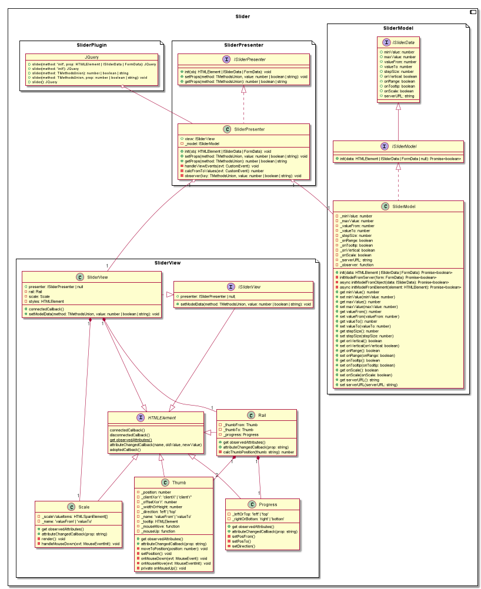

JQuery плагин слайдера диапазона - [посмотреть](https://maximshmatov.github.io/slider/) 
========

Данный проект представляет собой JQuery плагин слайдера диапазона,
который позволяет перетягиванием ползунков задавать какое-то целое числовое значение.
Он реализован в рамках программы обучения программированию,
но сгодится и для применения в производстве.

Основной технологический стек:
**JavaScript ES6, TypeScript, WebComponents, Jasmine, Karma.**

Обзор
-----------

1. Плагин имеет удобное API для подключения его к элементам на странице. 
Подключение происходит за счет замены искомого HTML элемента.
2. Плагин может быть инициализирован: 
    * из JS-объекта;
    * из HTML-элемента;
3. Доступны следующие опции плагина:
    * минимальное и максимальное значение;
    * размер шага;
    * вид (вертикальный или горизонтальный);
    * одиночное значение или интервал;
    * включать и отключать показ текущего значения над бегунком;
    * включать и отключать шкалу допустимых значений.
4. Стили плагина вынесены в отдельный файл, и это позволяет менять его дизайн и оформление.

### Клонирование репозитория и установка зависимостей:

Следующие команды требую наличие установленной Node.js v.14 и git 2.27.

`git clone https://github.com/MaximShmatov/slider.git` - клонирует репозиторий.

`npm install` - устанавливает зависимости.

### В директории проекта доступны следующие скрипты:

`npm start` - запускает проект в режиме разработки. 
Откройте [http://localhost:9000](http://localhost:3000) для просмотра в браузере.

`npm run build` - запускает производственную сборку проекта.

`npm run test` - запускает тестирование компонентов.

`npm run lint` - запускает линтер.

`npm run deploy` - публикация проекта на github pages.

### Подключение

```html
<script type="text/javascript" src="RangeSlider.js"></script>
```
или
```javascript
import 'range-slider/SliderPlugin.js';
```
### Инициализация

Инициализация осуществляется из произвольного объекта (type Record<string, unknown>).
По умолчанию слайдер инициализируется из "data" атрибутов искомого HTML элемента. 

* **Инициализация из HTML кода:**

```haml
<div id="slider" data-min-value="-10" data-max-value="100" data-value-from="0" data-step-size="1"></div>
```
* **Инициализация из JS кода:**
```javascript
$('#range-slider').slider('init');
```
или
```javascript
$('#range-slider').slider('init', {
    minValue:'-10',
    maxValue: 100,
    valueFrom: 0,
    valueTo: '10',
    stepSize: 1,
    isRange: true,
    isVertical: true,
    hasTooltip: 'true',
    hasScale: true,
});
```
### Установка / получение свойств

```javascript
$obj = jQuery('#range-slider').slider('init');
$obj.slider('minValue', '10');
const minValue = $obj.slider('minValue'); // minValue = 10
```
или
```javascript
$obj = jQuery('#range-slider').slider('init');
$obj.slider('all', {
  minValue: 0,
  maxValue: 100,
  valueFrom: 50,
  hasTooltip: true, 
});
const minValue = $obj.slider('all'); // minValue = {}
```

Архитектура
--------------

Плагин реализован на посредством TypeScript с применением шаблона проектирования MVP.  
Тесты к плагину прилагаются, и используют фреймворки Jasmine и Karma. 
Состав компонента плагина:
* Model.ts - класс модели с логикой валидации свойств; 
* View.ts - основной класс view компонента; 
  * ViewScale - класс шкалы;
  * ViewRail - класс рельса;
  * ViewProgress - класс шкалы прогресса;
  * ViewThumb - класс бегунка;
* Presenter.ts - класс контроллера (презентера),
  реализует API плагина (инициализация, установка и чтение опций);
* RangeSlider.ts - собственно сам плагин. Присоединяет функцию "Slider" к JQuery объекту;
* styles.module.sass - стили плагина. Также содержит модификаторы для вертикального состояния;
* index.d.ts - файл деклараций. Содержит интерфейсы и определения типов;

### Класс Model

Содержит методы установки и чтения свойств. 
Также содержит функцию (callback), которая вызывается в случае изменения значения свойства. 
При установке свойства, сеттеры проверяют переданное им значение на корректность 
(установка значения проходит валидацию). Объект модели представлен следующими свойствами:
* minValue: number - минимальное значение;
* maxValue: number - максимальное значение;
* valueFrom: number - текущее значение (если "onRange = true", то начальное значение);
* valueTo: number - если "onRange = true", то конечное значение, иначе игнорируется;
* stepSize: number - размер шага. Размер шага не может быть меньше единицы;
* isRange: boolean - вкл/выкл диапазона слайдера;
* callback: function - функция обратного вызова;

### Класс View

Представляет собой пользовательский HTML (веб-компонент). 
В случае изменения значения слайдера пользователем посредством перетаскивания бегунка,
генерирует событие "range-slider". Событие содержит в себе объект: "{name: string, value: number}".
В образовательных целях "view" слайдера реализован посредством разбит на "sub-view".
Для поддержки браузерами веб-компонентов к плагину были подключены 
[полифилы](https://www.webcomponents.org/polyfills).

### Класс Presenter

Содержит в себе реализацию "Presenter" шаблона проектирования MVP. 
Является связующим звеном между моделью и представлением. Устанавливает и читает свойства 
модели и вида, инициализирует их.

**Создание объекта класса "Presenter" происходит в следующем порядке:**
1. Создается объект модели.
2. Создается пользовательский элемент "range-slider".
3. Создается объект класса "Presenter" в конструктор которого передается
   пользовательский элемент и объект модели.
4. Конструктор инициализирует пользовательский элемент:
   * устанавливает атрибут "id";
   * устанавливает атрибут "class";
   * устанавливает функцию обратного вызова (callback);
5. Конструктор инициализирует модель путем установки "callback".

**Установка свойств слайдера или его инициализация происходит в следующем порядке:**
1. Вызывается метод установки свойства модели.
2. Вызывается функция обратного вызова.
3. Callback устанавливает заданный атрибут элемента `<range-slider>`.
4. "View" (<range-slider>) генерирует событие "range-slider" для оповещения внешнего кода об изменениях.

**Реакция "View" на действия пользователя происходит в следующем порядке:**
1. При перемещении бегунка, расчитывается значение относительно его позиции.
2. После расчетов вызывается "callback" презентера.
3. Презентер устанавливает новое значение в модель.

### Модул RangeSlider

Файл содержит в себе код расширения JQuery объекта перегруженной функцией "slider". 
Функция имеет следующие реализации:
* `slider(prop: TPluginProps | 'init', value?: string | Record<string, unknown>): JQuery` - устанавливает свойства слайдера или инициализирует его;
* `slider(prop: TPluginProps): number | boolean` - возвращает значение отдельного свойства слайдера;
* `slider(prop: 'all'): TModelData` - возвращает все свойства слайдера в виде объекта; 
из заданного объекта;

UML-диаграмма классов
--------------


